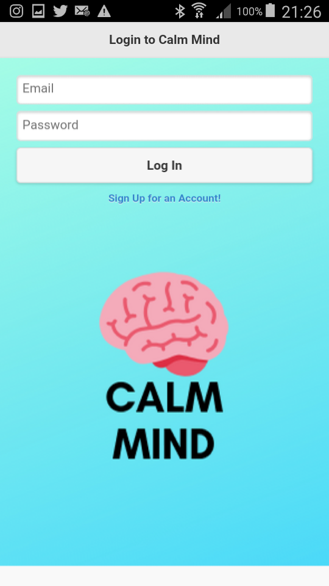
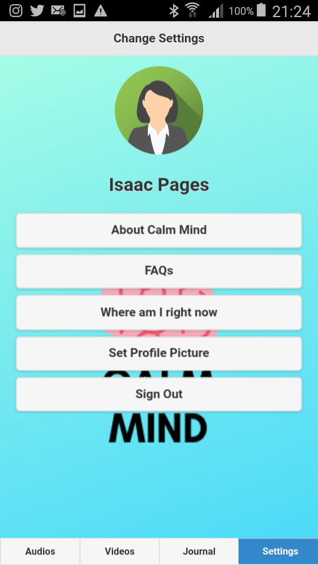
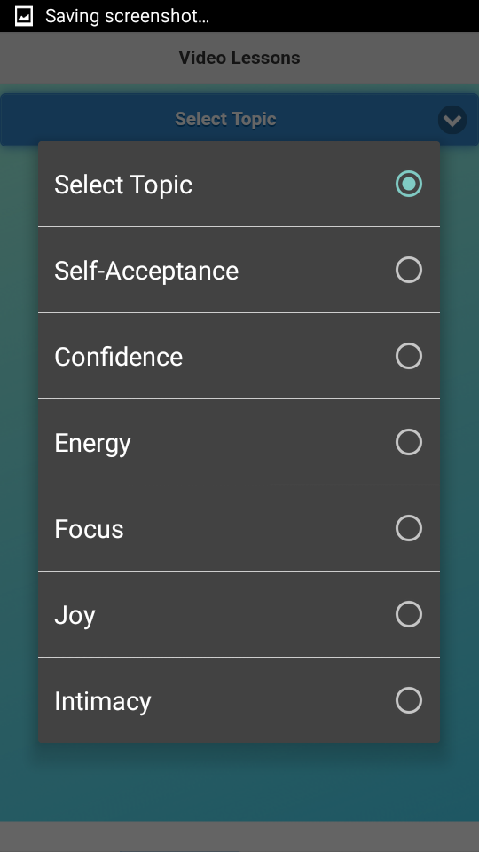
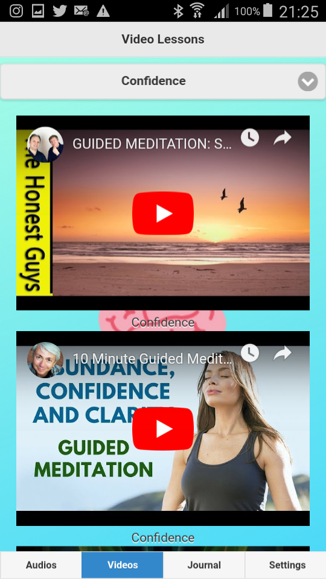
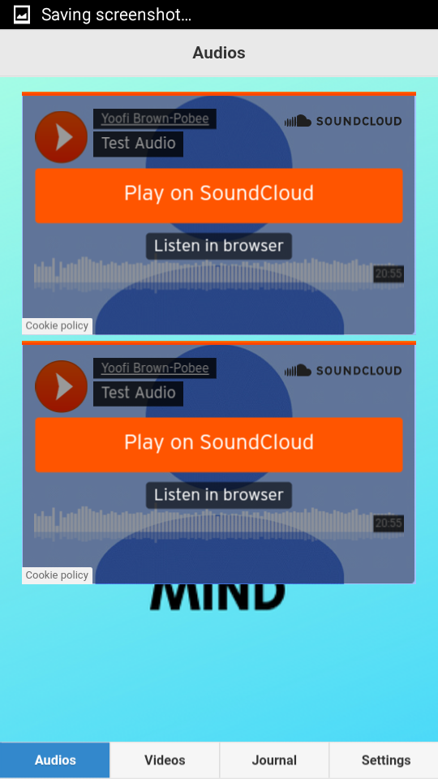
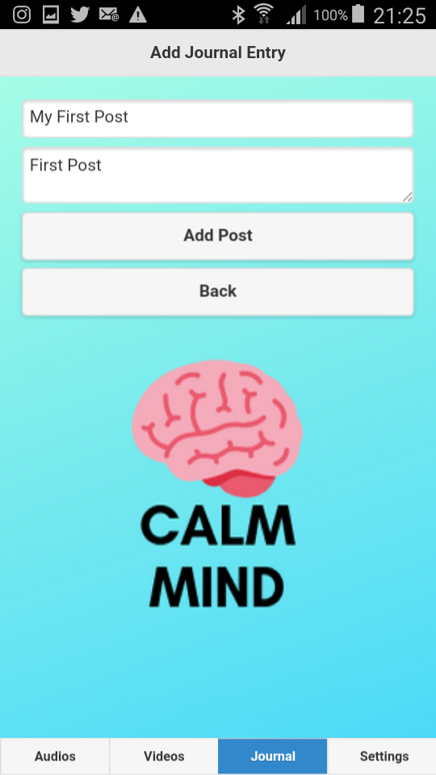
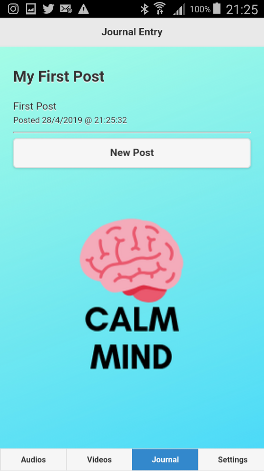

## Meditation App built with Web Technologies and PhoneGap
This project represents an effort to build a Native Android Application using Web Technologies and Phonegap Cordova. 

## Motivation
I had to use PhoneGap to build a web application into a Native Android Application as a requirement for my Mobile App Development Class. I therefore choose to build an app on around something I have an interest in: Mindfulness Meditation. I engage in Mindfulness Meditation because of its immense benefits on my mind and general well being. I sought to create a meditation app that allows me to journal my thoughts and save them on the cloud as well as view audio and video meditations I like. 

## Built With 
* HTML, CSS, Javascript (jQuery Mobile) - Front-end Design and Client Side Interactions
* Firebase - For Storage and User Authentication
* PhoneGap and Cordova - To convert web app into Native Android App and to access hardware functionalities of Android phone

## App Architecture

## Design Walkthrough
##### Login Page

##### Settings Page

##### Video Meditations Page

##### Audio Meditations Page

##### Journal Entry

##### In-App Browser 

### Phone Resources Used
* InApp Browser​ : When the user wants to learn more about meditation. They can head to the settings tab, click on the FAQs button to open up the in app browser which navigates them to the web page of a professional meditation teacher who answers some questions about meditation

* Online/Offline Detection:​ The Device detects when a user loses and gains connectivity and notifies them of this fact 

* Battery Resource Detection:​ The Device detects when the users battery is critical and low and notifies them of this fact 
  
* Camera Resource:​ The app can activate the devices camera for taking pictures. In the settings tab the user can call on the camera resource to take and set a profile picture. 

* Local Storage:​ A copy of the profile picture taken by the User is stored in offline local storage 

* GeoLocation:​ In the settings tab the user can find the geographic details of their location 
* Phone Motion(Vibration)​ : When alerts for battery level and connectivity are fired, the device vibrates 
